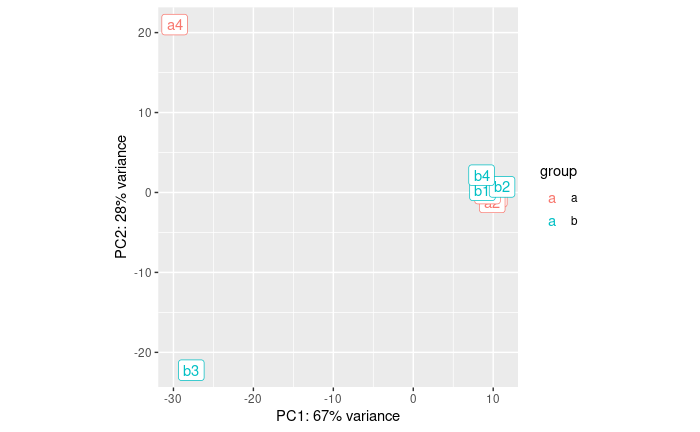
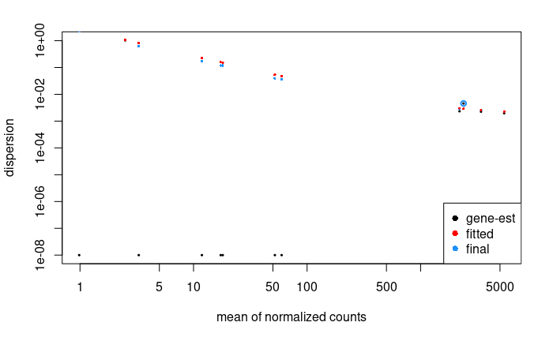
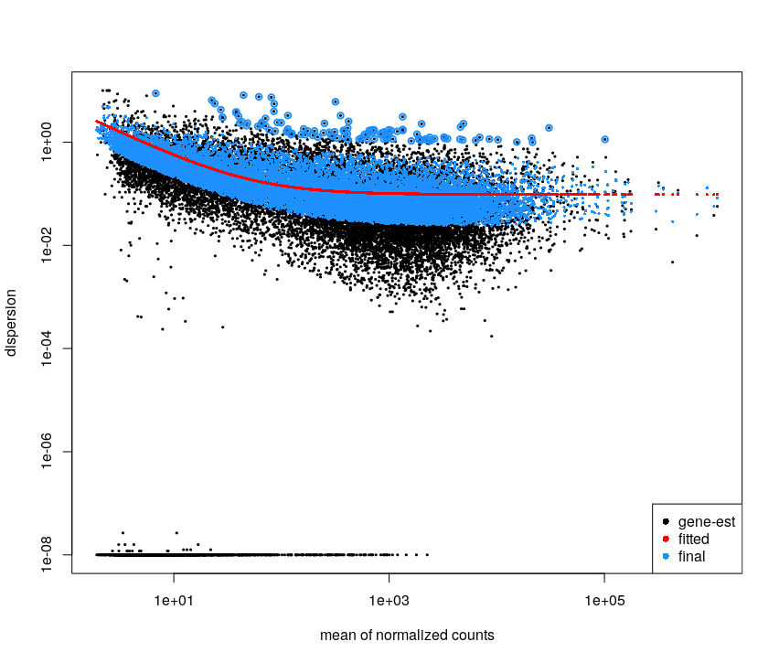
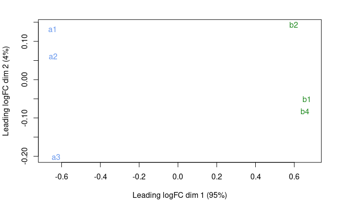
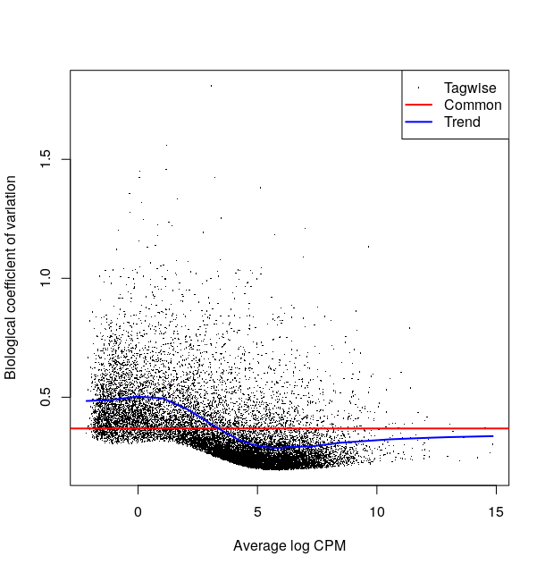
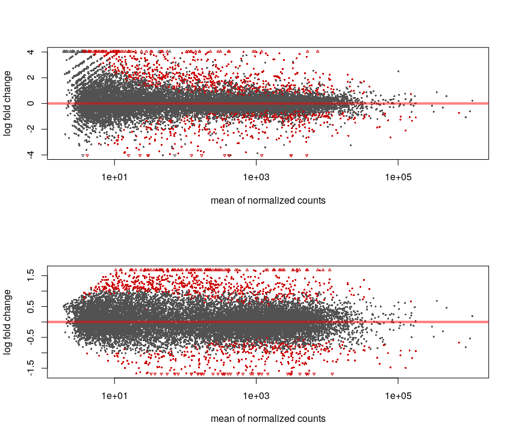
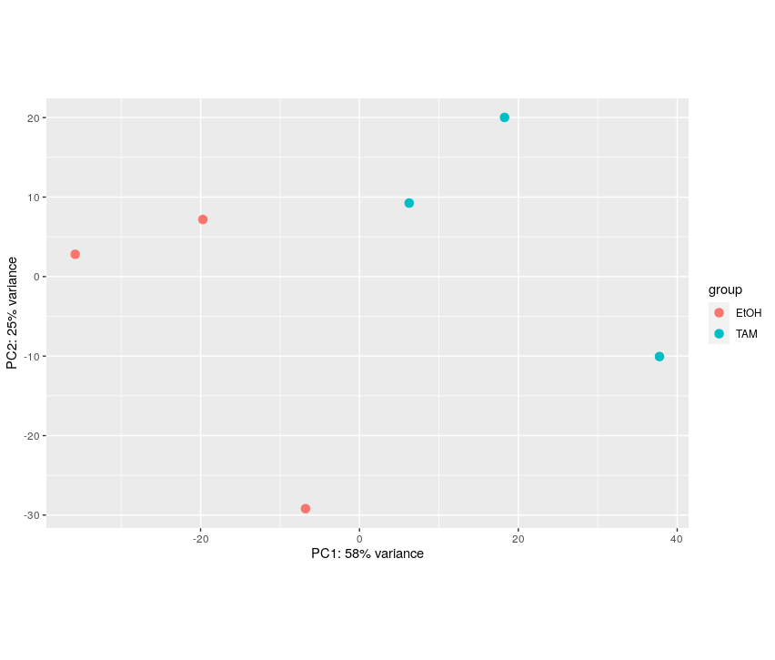
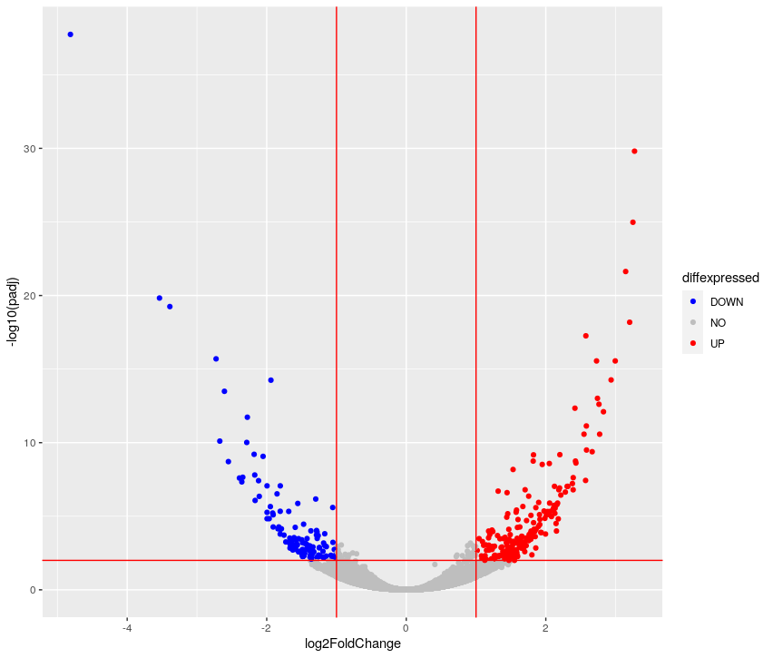
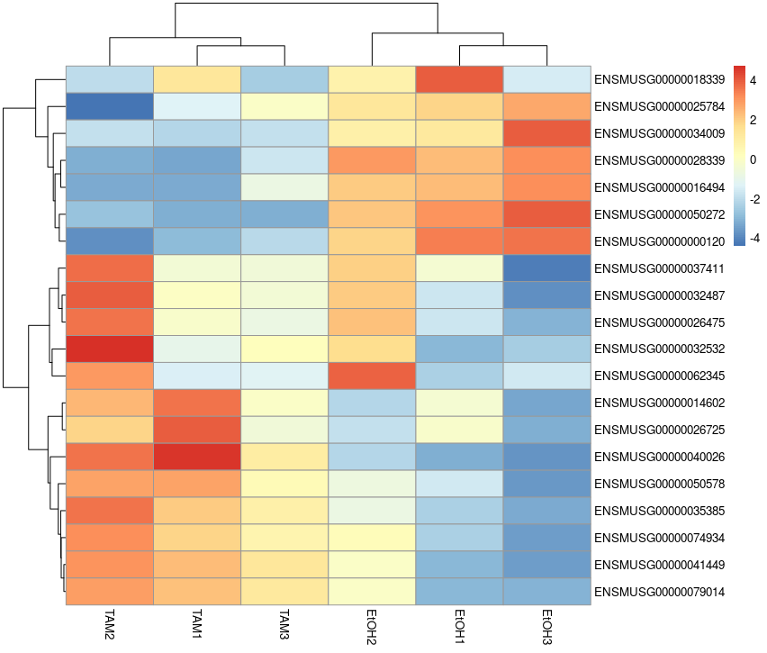
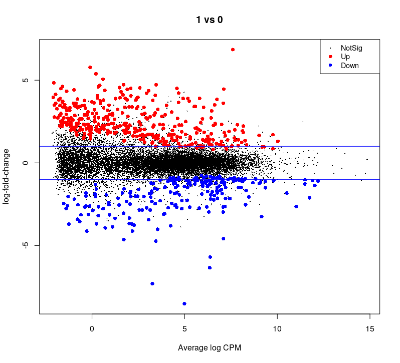

Once the reads have been mapped and counted, one can assess the differential expression of genes between different conditions.


**During this lesson, you will learn to :**

 * describe the different steps of data normalization and modelling commonly used for RNA-seq data.
 * detect significantly differentially-expressed genes using either edgeR or DESeq2.


## Material

[:fontawesome-solid-file-pdf: Download the presentation](../assets/pdf/RNA-Seq_06_DE.pdf){target=_blank : .md-button }

[Rstudio website](https://www.rstudio.com/)
<!-- Suggestion: RStudio reminders ??? Or link to some course or something? -->


[edgeR user's guide](https://www.bioconductor.org/packages/release/bioc/vignettes/edgeR/inst/doc/edgeRUsersGuide.pdf){target=_blank : .md-button }

[DESeq2 vignette](https://bioconductor.org/packages/release/bioc/vignettes/DESeq2/inst/doc/DESeq2.html){target=_blank : .md-button }


## Connexion to the Rstudio server

!!! note
	
	This step is intended only for users who attend the course with a teacher. Otherwise you will have to rely on your own installation of Rstudio.


The analysis of the read count data will be done on an RStudio instance, using the R language and some relevant [Bioconductor](http://bioconductor.org/) libraries.

As you start your session on the RStudio server, please make sure that you know where your data is situated with respect to your **working directory** (use `getwd()` and `setwd()` to respectively : know what your working is, and change it as necessary).


## Differential Expression Inference

Let's analze the `mouseMT` toy dataset.

??? note "DESeq2 analysis"


	```r
	library(DESeq2)
	library(ggplot2)
	library(pheatmap)
	```

	## reading

	We will use the trimmed reads

	```r
	folder  = "/shared/data/Solutions/mouseMT/044_STAR_map_trimmed/"

	# we skip the 4 first lines, which contains 
	# N_unmapped , N_multimapping , N_noFeature , N_ambiguous   

	sample_a1_table = read.table(paste0( folder , "sample_a1" , ".ReadsPerGene.out.tab") , 
	           row.names = 1 , skip = 4 )
	head( sample_a1_table )
	```

	```
						V2		V3		V4
	ENSMUSG00000064336	0		0		0	
	ENSMUSG00000064337	0		0		0	
	ENSMUSG00000064338	0		0		0	
	ENSMUSG00000064339	0		0		0	
	ENSMUSG00000064340	0		0		0	
	ENSMUSG00000064341	4046	1991	2055	
	```

	We are interested in the first columns, which contains counts for unstranded reads

	Let's use a loop to automatize the reading:
	```r
	raw_counts = data.frame( row.names =  row.names(sample_a1_table) )

	for( sample in c('a1','a2','a3','a4','b1','b2','b3','b4') ){
	  sample_table = read.table(paste0( folder , "sample_" , sample , ".ReadsPerGene.out.tab") , 
	                            row.names = 1 , skip = 4 )
	  
	  raw_counts[sample] = sample_table[ row.names(raw_counts) , "V2" ]
	  
	}

	head( raw_counts )
	```
	```
						a1		a2		a3		a4	b1	b2	b3	b4
	ENSMUSG00000064336	0		0		0		0	0	0	0	0
	ENSMUSG00000064337	0		0		0		0	0	0	0	0
	ENSMUSG00000064338	0		0		0		0	0	0	0	0
	ENSMUSG00000064339	0		0		0		2	0	0	0	0
	ENSMUSG00000064340	0		0		0		0	0	0	0	0
	ENSMUSG00000064341	4046	4098	4031	1	449	515	13	456
	```

	## setting up the experimental design

	```r
	#note: levels let's us define the reference levels
	treatment <- factor( c(rep("a",4), rep("b",4)), levels=c("a", "b") )
	colData <- data.frame(treatment, row.names = colnames(raw_counts))
	colData
	```
 
	```
		treatment
	a1	a			
	a2	a			
	a3	a			
	a4	a			
	b1	b			
	b2	b			
	b3	b			
	b4	b
	```


	## creating the DESeq data object and some QC

	```r
	dds <- DESeqDataSetFromMatrix(
	  countData = raw_counts, colData = colData, 
	  design = ~ treatment)
	dim(dds)
	```
	```
	[1] 37  8
	```


	Filter low count genes. 

	Here, we will apply a very soft filter and keep genes with at least 1 read in at least 4 samples (size of the smallest group).

	```r
	idx <- rowSums(counts(dds, normalized=FALSE) >= 1) >= 4
	dds.f <- dds[idx, ]
	dim(dds.f)
	```
	```
	[1] 13  8
	```

	We go from 37 to 13 genes


	We perform the estimation of dispersions 
	```r
	dds.f <- DESeq(dds.f)
	```
	```
	estimating size factors
	estimating dispersions
	gene-wise dispersion estimates
	mean-dispersion relationship
	-- note: fitType='parametric', but the dispersion trend was not well captured by the
	   function: y = a/x + b, and a local regression fit was automatically substituted.
	   specify fitType='local' or 'mean' to avoid this message next time.
	final dispersion estimates
	fitting model and testing
	```

	PCA plot of the samples:
	```r
	# blind	: whether to blind the transformation to the experimental design. 
	#   - blind=TRUE : comparing samples in a manner unbiased by prior information on samples, 
	#                  for example to perform sample QA (quality assurance).
	#   - blind=FALSE: should be used for transforming data for downstream analysis, 
	#                  where the full use of the design information should be made.

	vsd <- varianceStabilizingTransformation(dds.f, blind=TRUE )
	pcaData <- plotPCA(vsd, intgroup=c("treatment"))
	pcaData + geom_label(aes(x=PC1,y=PC2,label=name))
	```

	
	

	OK, so a4 and b3 are quite different from the rest.

	 * a4 was expected from the QC
	 * b3 we did not expect until now

	If we did the analysis with them, here is what we get:
	```r
	res <- results(dds.f)
	summary( res )
	```
	```
	out of 13 with nonzero total read count
	adjusted p-value < 0.1
	LFC > 0 (up)       : 0, 0%
	LFC < 0 (down)     : 0, 0%
	outliers [1]       : 7, 54%
	low counts [2]     : 0, 0%
	(mean count < 16)
	[1] see 'cooksCutoff' argument of ?results
	[2] see 'independentFiltering' argument of ?results
	```

	So, let's eliminate these two samples.

	## analysis without the outliers

	```r
	raw_counts_no_outliers = raw_counts[ , !( colnames(raw_counts) %in% c('a4','b3') ) ]

	treatment <- factor( c(rep("a",3), rep("b",3)), levels=c("a", "b") )
	colData <- data.frame(treatment, row.names = colnames(raw_counts_no_outliers))
	colData 
	```
 
	```
		treatment
	a1	a			
	a2	a			
	a3	a			
	b1	b			
	b2	b			
	b4	b
	```

	```r
	dds <- DESeqDataSetFromMatrix(
	  countData = raw_counts_no_outliers, colData = colData, 
	  design = ~ treatment)
	dim(dds)
	```
	```
	[1] 37  6
	```

	Filter low count genes: now the smallest group is 3
	```r
	idx <- rowSums(counts(dds, normalized=FALSE) >= 1) >= 3
	dds.f <- dds[idx, ]
	dim(dds.f)
	```
	```
	[1] 12  6
	```
	12 genes remaining

	We perform the estimation of dispersions 
	```r
	dds.f <- DESeq(dds.f)
	```
	```
	estimating size factors
	estimating dispersions
	gene-wise dispersion estimates
	mean-dispersion relationship
	final dispersion estimates
	fitting model and testing
	```

	PCA plot of the samples:
	```r
	vsd <- varianceStabilizingTransformation(dds.f, blind=TRUE )
	pcaData <- plotPCA(vsd, intgroup=c("treatment"))
	pcaData + geom_label(aes(x=PC1,y=PC2,label=name))
	```
	

	It looks much better. Seems like PC1 captures the group effect


	We plot the estimate of the dispersions
	```r
	# * black dot : raw
	# * red dot : local trend
	# * blue : corrected
	plotDispEsts(dds.f)
	```

	

	There is so few genes that this does not look super nice here

	For the Ruhland2016 dataset it looks like:

	

	This plot is not easy to interpret. It represents the amount of dispersion at different levels of expression. It is directly linked to our ability to detect differential expression.

	Here it looks about normal compared to typical bulk RNA-seq experiments : the dispersion is comparatively larger for lowly expressed genes.


	```r
	# extracting results for the treatment versus control contrast
	res <- results(dds.f)
	summary( res )
	```
	```
	out of 12 with nonzero total read count
	adjusted p-value < 0.1
	LFC > 0 (up)       : 1, 8.3%
	LFC < 0 (down)     : 2, 17%
	outliers [1]       : 0, 0%
	low counts [2]     : 0, 0%
	(mean count < 1)
	[1] see 'cooksCutoff' argument of ?results
	[2] see 'independentFiltering' argument of ?results
	```

	We can have a look at the coefficients of this model
	```r
	head(coef(dds.f)) # the second column corresponds to the difference between the 2 conditions
	```
	```
	                   Intercept treatment_b_vs_a
	ENSMUSG00000064341 12.084282      -3.33601412
	ENSMUSG00000064345  6.112479      -0.99101369
	ENSMUSG00000064351  3.757967       0.64546475
	ENSMUSG00000064354 10.209339       1.44160442
	ENSMUSG00000064357 11.763707      -0.06245774
	ENSMUSG00000064358  6.026334      -0.26447858
	```

	Here, it contains an intercept and a coefficient for the difference between the two groups.

	MA plot:
	```r
	res.lfc <- lfcShrink(dds.f, coef=2, res=res)
	DESeq2::plotMA(res.lfc)
	```
	

	Volcano plot:
	```r
	FDRthreshold = 0.01
	logFCthreshold = 1.0
	# add a column of NAs
	res.lfc$diffexpressed <- "NO"
	# if log2Foldchange > 1 and pvalue < 0.01, set as "UP" 
	res.lfc$diffexpressed[res.lfc$log2FoldChange > logFCthreshold & res.lfc$padj < FDRthreshold] <- "UP"
	# if log2Foldchange < 1 and pvalue < 0.01, set as "DOWN"
	res.lfc$diffexpressed[res.lfc$log2FoldChange < -logFCthreshold & res.lfc$padj < FDRthreshold] <- "DOWN"

	ggplot( data = data.frame( res.lfc ) , aes( x=log2FoldChange , y = -log10(padj) , col =diffexpressed ) ) + 
	  geom_point() + 
	  geom_vline(xintercept=c(-logFCthreshold, logFCthreshold), col="red") +
	  geom_hline(yintercept=-log10(FDRthreshold), col="red") +
	  scale_color_manual(values=c("blue", "grey", "red"))

	table(res.lfc$diffexpressed)
	```
	```
	DOWN   NO   UP 
	   1   10    1 
	```
	


	Heatmap:
	```r
	vsd.counts <- assay(vsd)

	topVarGenes <- head(order(rowVars(vsd.counts), decreasing = TRUE), 20)
	mat  <- vsd.counts[ topVarGenes, ] #scaled counts of the top genes
	mat  <- mat - rowMeans(mat)  # centering
	pheatmap(mat)
	```
	

	## saving results to file

	note: a CSV file can be imported into Excel
	```r
	write.csv( res ,'mouseMT.DESeq2.results.csv' )
	```

??? note "edgeR analysis"

	
	```r
	# setup
	library(edgeR)
	library(ggplot2)
	```


	## reading

	We will use the trimmed reads

	First we try with the sample_a1:

	```r
	folder  = "/shared/data/Solutions/mouseMT/044_STAR_map_trimmed/"

	# we skip the 4 first lines, which contains 
	# N_unmapped , N_multimapping , N_noFeature , N_ambiguous   

	sample_a1_table = read.table(paste0( folder , "sample_a1" , ".ReadsPerGene.out.tab") , 
	           row.names = 1 , skip = 4 )
	head( sample_a1_table )
	```
	```
						V2		V3		V4
	ENSMUSG00000064336	0		0		0	
	ENSMUSG00000064337	0		0		0	
	ENSMUSG00000064338	0		0		0	
	ENSMUSG00000064339	0		0		0	
	ENSMUSG00000064340	0		0		0	
	ENSMUSG00000064341	4046	1991	2055	
	```

	We are interested in the first columns, which contains counts for unstranded reads


	Let's use a loop to automatize the reading:

	```r
	raw_counts = data.frame( row.names =  row.names(sample_a1_table) )

	for( sample in c('a1','a2','a3','a4','b1','b2','b3','b4') ){
	  sample_table = read.table(paste0( folder , "sample_" , sample , ".ReadsPerGene.out.tab") , 
	                            row.names = 1 , skip = 4 )
	  
	  raw_counts[sample] = sample_table[ row.names(raw_counts) , "V2" ]
	  
	}

	head( raw_counts )
	```
	```
						a1		a2		a3		a4	b1	b2	b3	b4
	ENSMUSG00000064336	0		0		0		0	0	0	0	0
	ENSMUSG00000064337	0		0		0		0	0	0	0	0
	ENSMUSG00000064338	0		0		0		0	0	0	0	0
	ENSMUSG00000064339	0		0		0		2	0	0	0	0
	ENSMUSG00000064340	0		0		0		0	0	0	0	0
	ENSMUSG00000064341	4046	4098	4031	1	449	515	13	456
	```


	## experimental design


	> note: levels let's us define the reference levels

	```r
	treatment <- factor( c(rep("a",4), rep("b",4)), levels=c("a", "b") )
	names(treatment) = colnames(raw_counts)

	treatment
	```
	```
	a1 a2 a3 a4 b1 b2 b3 b4 
	 a  a  a  a  b  b  b  b 
	Levels: a b
	```

	## edgeR  object preprocessing and QC

	Creating the edgeR DGE object and filtering low-count genes.

	```r
	dge.all <- DGEList(counts = raw_counts , group = treatment)  

	dge.f.design <- model.matrix(~ treatment)

	# filtering by expression level. See ?filterByExpr for details
	keep <- filterByExpr(dge.all)
	dge.f <- dge.all[keep, keep.lib.sizes=FALSE]
	table( keep )
	```
	```
	keep
	FALSE  TRUE 
	   28     9 
	```

	```r
	#normalization
	dge.f <- calcNormFactors(dge.f)
	dge.f$samples
	```
	```
		group	lib.size	norm.factors
	a1	a		13799		1.2101311	
	a2	a		13649		1.2130900	
	a3	a		13938		1.2131513	
	a4	a		6831		0.1058474	
	b1	b		13703		1.3614563	
	b2	b		13627		1.3728761	
	b3	b		162			2.0759281	
	b4	b		13687		1.3671996	
	```
	We represent the distances between the samples using MDS:

	```r
	plotMDS( dge.f , col = c('cornflowerblue','forestgreen')[treatment] )
	```
	

	OK, so a4 and b3 are quite different from the rest.

	 * a4 was expected from the QC
	 * b3 we did not expect until now

	If we did the analysis with them, here is what we get:
	```r
	# estimate of the dispersion
	dge.f <- estimateDisp(dge.f,dge.f.design , robust = T)
	# testing for differential expression. 
	dge.f.et <- exactTest(dge.f)
	topTags(dge.f.et)
	```
	```	 
						logFC		logCPM		PValue		FDR
	ENSMUSG00000065947	-5.06512022	13.51727	0.006432974	0.05110489
	ENSMUSG00000064351	-7.46603064	20.14951	0.011356643	0.05110489
	ENSMUSG00000064345	3.35236454	15.28962	0.050902734	0.13212506
	ENSMUSG00000064341	-2.67947447	16.69126	0.058722251	0.13212506
	ENSMUSG00000064354	1.58127747	16.60293	0.263189690	0.42743645
	ENSMUSG00000064368	1.75395362	12.51557	0.284957631	0.42743645
	ENSMUSG00000064358	-0.10554311	11.49478	0.912516094	0.96610797
	ENSMUSG00000064363	-0.08216781	17.90743	0.950808801	0.96610797
	ENSMUSG00000064357	0.06455233	17.18842	0.966107973	0.96610797
	```

	no gene is significantly DE.

	So, let's eliminate these two samples.

	## analysis without the outliers


	```r
	raw_counts_no_outliers = raw_counts[ , !( colnames(raw_counts) %in% c('a4','b3') ) ]
	head( raw_counts_no_outliers )
	```
	```
					 	a1		a2		a3		b1	b2	b4
	ENSMUSG00000064336	0		0		0		0	0	0
	ENSMUSG00000064337	0		0		0		0	0	0
	ENSMUSG00000064338	0		0		0		0	0	0
	ENSMUSG00000064339	0		0		0		0	0	0
	ENSMUSG00000064340	0		0		0		0	0	0
	ENSMUSG00000064341	4046	4098	4031	449	515	456
	```

	```r
	treatment <- factor( c(rep("a",3), rep("b",3)), levels=c("a", "b") )
	colData <- data.frame(treatment, row.names = colnames(raw_counts_no_outliers))
	colData 
	```
	```
		treatment
	a1	a			
	a2	a			
	a3	a			
	b1	b			
	b2	b			
	b4	b
	```

	```r
	dge.all <- DGEList(counts = raw_counts_no_outliers , group = treatment)  

	dge.f.design <- model.matrix(~ treatment)

	# filtering by expression level. See ?filterByExpr for details
	keep <- filterByExpr(dge.all)
	dge.f <- dge.all[keep, keep.lib.sizes=FALSE]
	table( keep )
	```
	```
	keep
	FALSE  TRUE 
	   28     9 
	```

	We compute the normalization factor for each library:
	```r
	#normalization
	dge.f <- calcNormFactors(dge.f)
	dge.f$samples
	```
	```
	 	group	lib.size	norm.factors
	a1	a		13799		0.9437444	
	a2	a		13649		0.9277668	
	a3	a		13938		0.9412032	
	b1	b		13703		1.0672149	
	b2	b		13627		1.0651230	
	b4	b		13687		1.0675095	
	```

	We represent the distances between the samples using MDS:

	```r
	plotMDS( dge.f , col = c('cornflowerblue','forestgreen')[treatment] )
	```
	

	It looks much better. Seems like PC1 captures the group effect.

	We now fit the model:

	```r
	# estimate of the dispersion
	dge.f <- estimateDisp(dge.f,dge.f.design , robust = T)
	plotBCV(dge.f)
	```
	

	There is so few genes that this does not look super nice here.

	Here is how it looks like on the Ruhland2016 data:

	

	This plot is not easy to interpret. It represents the amount of biological variation at different levels of expression. It is directly linked to our ability to detect differential expression.

	Here it looks about normal compared to other bulk RNA-seq experiments : the variation is comparatively larger for lowly expressed genes.


	```r
	# testing for differential expression. 
	# This method is recommended when you only have 2 groups to compare
	dge.f.et <- exactTest(dge.f)
	topTags(dge.f.et) # printing the genes where the p-value of differential expression if the lowest
	```
	```
						logFC			logCPM		PValue			FDR
	ENSMUSG00000064341	-3.2728209590	17.34360	0.000000e+00	0.000000e+00
	ENSMUSG00000064354	1.5046106466	17.35950	0.000000e+00	0.000000e+00
	ENSMUSG00000064345	-0.9251244495	11.92467	4.542291e-08	1.362687e-07
	ENSMUSG00000064368	0.7262191019	10.55226	1.337410e-02	3.009174e-02
	ENSMUSG00000064351	0.7031516899	10.50496	2.006905e-02	3.612429e-02
	ENSMUSG00000064358	-0.1964770294	12.14888	2.110506e-01	3.165759e-01
	ENSMUSG00000065947	0.2623477474	10.00748	4.831813e-01	5.851717e-01
	ENSMUSG00000064363	-0.0127783014	18.61543	5.201527e-01	5.851717e-01
	ENSMUSG00000064357	0.0006819028	17.93963	9.833826e-01	9.833826e-01
	```

	We can see 3 genes with FDR < 0.01 and 2 others with 0.01 < FDR < 0.05.

	```r
	summary(decideTests(dge.f.et , p.value = 0.01)) # let's use 0.01 as a threshold
	```
	```
		    b-a
	Down     2
	NotSig   6
	Up       1
	```

	Let's plot these:
	```r
	## plot all the logFCs versus average count size. Significantly DE genes are  colored
	plotMD(dge.f.et)
	# lines at a log2FC of 1/-1, corresponding to a shift in expression of x2 
	abline(h=c(-1,1), col="blue")
	abline(h=c(0), col="grey")
	```
	

	Volcano plot

	```r
	allGenes = topTags(dge.f.et , n = nrow(dge.f.et$table) )$table

	FDRthreshold = 0.01
	logFCthreshold = 1.0
	# add a column of NAs
	allGenes$diffexpressed <- "NO"
	# if log2Foldchange > 1 and pvalue < 0.01, set as "UP" 
	allGenes$diffexpressed[allGenes$logFC > logFCthreshold & allGenes$FDR < FDRthreshold] <- "UP"
	# if log2Foldchange < 1 and pvalue < 0.01, set as "DOWN"
	allGenes$diffexpressed[allGenes$logFC < -logFCthreshold & allGenes$FDR < FDRthreshold] <- "DOWN"

	ggplot( data = allGenes , aes( x=logFC , y = -log10(FDR) , col =diffexpressed ) ) + 
	  geom_point() + 
	  geom_vline(xintercept=c(-logFCthreshold, logFCthreshold), col="red") +
	  geom_hline(yintercept=-log10(FDRthreshold), col="red") +
	  scale_color_manual(values=c("blue", "grey", "red"))
	```
	

	## writing the table of results

	```r
	write.csv( allGenes , 'mouseMT.edgeR.results.csv')
	```


!!! note "From ensembl gene ids to gene names"

	We can convert between different gene ids using the `bitr` function from `clusterProfiler`
	```r
	library(clusterProfiler)
	library(org.Mm.eg.db)

	genes_universe <- bitr(rownames(allGenes), fromType = "ENSEMBL",
	                       toType = c("ENTREZID", "SYMBOL"),
	                       OrgDb = "org.Mm.eg.db")
	genes_universe
	```
	```
	             ENSEMBL ENTREZID SYMBOL
	1 ENSMUSG00000064341    17716    ND1
	2 ENSMUSG00000064354    17709   COX2
	3 ENSMUSG00000064345    17717    ND2
	4 ENSMUSG00000064368    17722    ND6
	5 ENSMUSG00000064351    17708   COX1
	6 ENSMUSG00000064358    17710   COX3
	7 ENSMUSG00000065947    17720   ND4L
	8 ENSMUSG00000064363    17719    ND4
	9 ENSMUSG00000064357    17705   ATP6
	```

	> Here is the list of [orgDb packages](https://bioconductor.org/packages/release/BiocViews.html#___OrgDb). For non-model organisms it will be more complex.


### Task

Use either edgeR or DESeq2 to conduct a differential expression analysis on the Ruhland2016 and/or Liu2015 dataset.

You can find the expression matrices on the server at: `/shared/data/Solutions/Ruhland2016/countFiles/featureCounts_Ruhland2016.counts.txt` and `/shared/data/Solutions/Liu2015/countFiles/featureCounts_Liu2015.counts.txt`

Or you may download them :

[Liu2015 count matrix](../assets/txt/featureCounts_Liu2015.counts.txt){target=_blank : .md-button }

[Ruhland2016 count matrix](../assets/txt/featureCounts_Ruhland2016.counts.txt){target=_blank : .md-button }

!!! note

	 * Generally, users find the syntax and workflow of DESeq2 easier for getting started.
	 * If you have the time, conduct a differential expression analysis using both DESeq2 and edgeR.
	 * Follow the vignettes/user's guide! They are the most up-to-date and generally contain everything a newcomer might need, including worked-out examples.

<!-- Suggestion: ExploreModelMatrix for visualising contrasts:
https://github.com/csoneson/ExploreModelMatrix
https://bioconductor.org/packages/release/bioc/html/ExploreModelMatrix.html
Soneson C, Marini F, Geier F, Love M, Stadler M (2020). “ExploreModelMatrix: Interactive exploration for improved understanding of design matrices and linear models in R.” F1000Research, 9, 512. doi: 10.12688/f1000research.24187.2. 
-->

### DESeq2 correction

[DESeq2 vignette](https://bioconductor.org/packages/release/bioc/vignettes/DESeq2/inst/doc/DESeq2.html){target=_blank : .md-button }

??? success "read in the data"
	
	```R
	# setup
	library(DESeq2)
	library(ggplot2)
	
	
	# reading the counts files - adapt the file path to your situation
	raw_counts <-read.table('/shared/data/Solutions/Ruhland2016/countFiles/featureCounts_Ruhland2016.counts.txt' , 
	                        skip=1 , sep="\t" , header=T)
	
	# setting up row names as ensembl gene ids
	row.names(raw_counts) = raw_counts$Geneid
	
	## looking at the beginning of that table
	raw_counts[1:5,1:5]

	# removing these first columns to keep only the sample counts
	raw_counts = raw_counts[ ,  -1:-6  ] 
	

	# changing column names
	names( raw_counts) = gsub('_.*', '', gsub('.*.SRR[0-9]{7}_', '', names(raw_counts) ) )
	
	# some checking of what we just read
	head(raw_counts); tail(raw_counts); dim(raw_counts)
	colSums(raw_counts) # total number of counted reads per sample
	```

??? success "preprocessing"

	```R
	## telling DESeq2 what the experimental design was
	# note: by default, the 1st level is considered to be the reference/control/WT/...
	treatment <- factor( c(rep("EtOH",3), rep("TAM",3)), levels=c("EtOH", "TAM") )
	colData <- data.frame(treatment, row.names = colnames(raw_counts))
	colData
	
	## creating the DESeq data object & positing the model
	dds <- DESeqDataSetFromMatrix(
	  countData = raw_counts, colData = colData, 
	  design = ~ treatment)
	dim(dds)
	
	## filter low count genes. Here, only keep genes with at least 2 samples where there are at least 5 reads.
	idx <- rowSums(counts(dds, normalized=FALSE) >= 5) >= 2
	dds.f <- dds[idx, ]
	dim(dds.f)
	
	# we go from 55414 to 19378 genes
	```

	Around 19k genes pass our minimum expression threshold, quite typical for a bulk Mouse RNA-seq experiment.


??? success "estimate dispersion / model fitting"

	```R
	# we perform the estimation of dispersions 
	dds.f <- DESeq(dds.f)
	
	# we plot the estimate of the dispersions
	# * black dot : raw
	# * red dot : local trend
	# * blue : corrected
	plotDispEsts(dds.f)
	
	# extracting results for the treatment versus control contrast
	res <- results(dds.f)
	```

	

	This plot is not easy to interpret. It represents the amount of dispersion at different levels of expression. It is directly linked to our ability to detect differential expression.

	Here it looks about normal compared to typical bulk RNA-seq experiments : the dispersion is comparatively larger for lowly expressed genes.


??? success "looking at the results"

	```R
	# adds estimate of the LFC the results table. 
	# This shrunk logFC estimate is more robust than the raw value
	
	head(coef(dds.f)) # the second column corresponds to the difference between the 2 conditions
	res.lfc <- lfcShrink(dds.f, coef=2, res=res)
	
	#plotting to see the difference.  
	par(mfrow=c(2,1))
	DESeq2::plotMA(res)
	DESeq2::plotMA(res.lfc)
	# -> with shrinkage, the significativeness and logFC are more consistent
	par(mfrow=c(1,1))
	```

	

	Without the shrinkage, we can see that for low counts we can see a high log-fold change but non significant (ie. we see a large difference but with variance is also so high that this observation may be due to chance only).

	The shrinkage corrects this and the relationship between logFC and significance is smoother.


	```R
	# we apply the variance stabilising transformation to make the read counts comparable across libraries
	# (nb : this is not needed for DESeq DE analysis, but rather for visualisations that compare expression across samples, such as PCA. This replaces normal PCA scaling)
	vst.dds.f <- vst(dds.f, blind = FALSE)
	vst.dds.f.counts <- assay(vst.dds.f)
	
	plotPCA(vst.dds.f, intgroup = c("treatment"))
	```
	

	The first axis (58% of the variance) seems linked to the grouping of interest.


	```R
	## ggplot2-based volcano plot
	library(ggplot2)

	FDRthreshold = 0.01
	logFCthreshold = 1.0
	# add a column of NAs
	res.lfc$diffexpressed <- "NO"
	# if log2Foldchange > 1 and pvalue < 0.01, set as "UP" 
	res.lfc$diffexpressed[res.lfc$log2FoldChange > logFCthreshold & res.lfc$padj < FDRthreshold] <- "UP"
	# if log2Foldchange < 1 and pvalue < 0.01, set as "DOWN"
	res.lfc$diffexpressed[res.lfc$log2FoldChange < -logFCthreshold & res.lfc$padj < FDRthreshold] <- "DOWN"
	
	ggplot( data = data.frame( res.lfc ) , aes( x=log2FoldChange , y = -log10(padj) , col =diffexpressed ) ) + 
	  geom_point() + 
	  geom_vline(xintercept=c(-logFCthreshold, logFCthreshold), col="red") +
	  geom_hline(yintercept=-log10(FDRthreshold), col="red") +
	  scale_color_manual(values=c("blue", "grey", "red"))
	
	table(res.lfc$diffexpressed)
	```
	
	```
	 DOWN    NO    UP 
	  131 19002   245 
	```

	
	
	
	```R
	library(pheatmap)
	topVarGenes <- head(order(rowVars(vst.dds.f.counts), decreasing = TRUE), 20)
	mat  <- vst.dds.f.counts[ topVarGenes, ] #scaled counts of the top genes
	mat  <- mat - rowMeans(mat)  # centering
	pheatmap(mat)
	```
	
	


	```R
	# saving results to file
	# note: a CSV file can be imported into Excel
	write.csv( res ,'Ruhland2016.DESeq2.results.csv' )
	```


<!-- Question from students: how to map ENSEMBL gene IDs to gene names? -->


### EdgeR correction

[edgeR user's guide](https://www.bioconductor.org/packages/release/bioc/vignettes/edgeR/inst/doc/edgeRUsersGuide.pdf){target=_blank : .md-button }


??? success "read in the data"

	```R
	library(edgeR)
	library(ggplot2)

	# reading the counts files - adapt the file path to your situation
	raw_counts <- read.table('.../Ruhland2016_featureCount_result.counts' , 
	           skip=1 , sep="\t" , header=T)
	
	# setting up row names as ensembl gene ids
	row.names(raw_counts) = raw_counts$Geneid
	
	# removing these first columns to keep only the sample counts
	raw_counts = raw_counts[ ,  -1:-6  ] 
	
	# changing column names
	names( raw_counts) = gsub('_.*', '', gsub('.*.SRR[0-9]{7}_', '', names(raw_counts) ) )

	# some checking of what we just read
	head(raw_counts); tail(raw_counts); dim(raw_counts)
	colSums(raw_counts) # total number of counted reads per sample

	```
	

??? success "edgeR object preprocessing"

	```R
	# setting up the experimental design AND the model
	#  -> the first 3 samples form a group, the 3 remaining are the other group
	treatment <-  c(rep("EtOH",3), rep("TAM",3))
	dge.f.design <- model.matrix(~ treatment)

	# creating the edgeR DGE object
	dge.all <- DGEList(counts = raw_counts , group = treatment)  

	# filtering by expression level. See ?filterByExpr for details
	keep <- filterByExpr(dge.all)
	dge.f <- dge.all[keep, keep.lib.sizes=FALSE]
	table( keep )
	```

	```
	keep
	FALSE  TRUE 
	39702 15712 
	```

	Around 16k genes are sufficiently expressed to be retained.

	```R
	#normalization
	dge.f <- calcNormFactors(dge.f)
	dge.f$samples
	```

	Each sample has been associated with a normalization factor.


??? success "edgeR model fitting"

	```R
	# estimate of the dispersion
	dge.f <- estimateDisp(dge.f,dge.f.design , robust = T)
	plotBCV(dge.f)
	```
	

	This plot is not easy to interpret. It represents the amount of biological variation at different levels of expression. It is directly linked to our ability to detect differential expression.

	Here it looks about normal compared to other bulk RNA-seq experiments : the variation is comparatively larger for lowly expressed genes.

	```R
	# testing for differential expression. 
	# This method is recommended when you only have 2 groups to compare
	dge.f.et <- exactTest(dge.f)
	topTags(dge.f.et) # printing the genes where the p-value of differential expression if the lowest
	```
	
	```
	Comparison of groups:  TAM-EtOH 
	                       logFC   logCPM       PValue          FDR
	ENSMUSG00000050272 -8.522762 4.988067 2.554513e-28 3.851950e-24
	ENSMUSG00000075014  3.890079 5.175181 2.036909e-25 1.535728e-21
	ENSMUSG00000009185  3.837786 6.742422 1.553964e-22 7.810743e-19
	ENSMUSG00000075015  3.778523 3.274463 2.106799e-22 7.942107e-19
	ENSMUSG00000028339 -5.692069 6.372980 4.593720e-16 1.385374e-12
	ENSMUSG00000040111 -2.141221 6.771538 4.954522e-15 1.245154e-11
	ENSMUSG00000041695  4.123972 1.668247 6.057909e-15 1.304960e-11
	ENSMUSG00000072941  3.609170 7.080257 1.807618e-14 3.407135e-11
	ENSMUSG00000000120 -6.340146 6.351489 2.507019e-14 4.200371e-11
	ENSMUSG00000034981  3.727969 5.244841 3.934957e-14 5.933521e-11
	```
	
	```R
	# see how many genes are DE
	summary(decideTests(dge.f.et , p.value = 0.01)) # let's use 0.01 as a threshold
	```
	
	```
	         TAM-EtOH 
	Down     109
	NotSig 15393
	Up       210
	```

	The comparison is TAM-EtOH, so "Up", corresponds to a higher in group TAM compared to group EtOH.


??? success "edgeR looking at differentially-expressed genes"

	```R
	## plot all the logFCs versus average count size. Significantly DE genes are  colored
	par(mfrow=c(1,1))
	plotMD(dge.f.et)
	# lines at a log2FC of 1/-1, corresponding to a shift in expression of x2 
	abline(h=c(-1,1), col="blue") 
	```

	

	```R	
	## Volcano plot
	allGenes = topTags(dge.f.et , n = nrow(dge.f.et$table) )$table
	
	FDRthreshold = 0.01
	logFCthreshold = 1.0
	# add a column of NAs
	allGenes$diffexpressed <- "NO"
	# if log2Foldchange > 1 and pvalue < 0.01, set as "UP" 
	allGenes$diffexpressed[allGenes$logFC > logFCthreshold & allGenes$FDR < FDRthreshold] <- "UP"
	# if log2Foldchange < 1 and pvalue < 0.01, set as "DOWN"
	allGenes$diffexpressed[allGenes$logFC < -logFCthreshold & allGenes$FDR < FDRthreshold] <- "DOWN"
	
	ggplot( data = allGenes , aes( x=logFC , y = -log10(FDR) , col =diffexpressed ) ) + 
	  geom_point() + 
	  geom_vline(xintercept=c(-logFCthreshold, logFCthreshold), col="red") +
	  geom_hline(yintercept=-log10(FDRthreshold), col="red") +
	  scale_color_manual(values=c("blue", "grey", "red"))
	```
	

	```R
	## writing the table of results
	write.csv( allGenes , 'Ruhland2016.edgeR.results.csv')
	```

??? success "edgeR extra stuff"

	```R
	# how to extract log CPM
	logcpm <- cpm(dge.f, prior.count=2, log=TRUE)

	```


	```R
	# there is another fitting method reliying on quasi-likelihood, which is useful when the model is more complex (ie. more than 1 factor with 2 levels)
	dge.f.QLfit <- glmQLFit(dge.f, dge.f.design)
	dge.f.qlt <- glmQLFTest(dge.f.QLfit, coef=2)
	
	# you can see the results are relatively different. The order of genes changes a bit, and the p-values are more profoundly affected
	topTags(dge.f.et)
	topTags(dge.f.qlt)
	
	## let's see how much the two methods agree:
	par(mfrow=c(1,2))
	plot( dge.f.et$table$logFC , 
	      dge.f.qlt$table$logFC,
	      xlab = 'exact test logFC',
	      ylab = 'quasi-likelihood test logFC')
	
	print( paste('logFC pearson correlation coefficient :' , 
	             cor(dge.f.et$table$logFC ,dge.f.qlt$table$logFC) ) )
	
	plot( log10(dge.f.et$table$PValue ), 
	      log10(dge.f.qlt$table$PValue) ,
	      xlab = 'exact test p-values (log10)',
	      ylab = 'quasi-likelihood test p-values (log10)')
	
	print( paste( "P-values spearman correlation coefficient",
	              cor( log10(dge.f.et$table$PValue ), log10(dge.f.qlt$table$PValue) , method = 'spearman' )))
	
	```
	
	```
	"logFC pearson correlation coefficient : 0.999997655536736"
	"P-values spearman correlation coefficient 0.993238670517236"
	```

	


	The logFC are highly correlated.
	FDRs show less correlation but their **rank** are higly correlated : they come in a very similar order.


## Additional : importing counts from salmon with `tximport`

The `tximport` R packages offers a fairly simple set of functions to get **transcript-level** expression quantification from salmon or kallisto into a differential **gene** expression analysis.


**Task :** import salmon transcript-level quantification in R in order to perform a DE analysis on it using either edgeR or DESeq2.
**Additional:** compare the results with the ones obtained from STAR-aligned reads.

 * The [tximport vignette](https://bioconductor.org/packages/release/bioc/vignettes/tximport/inst/doc/tximport.html) is a very good guide for this task.
 * If you have not computed them, you can find files with expression quantifications in : `/shared/data/Solutions/Liu2015/` and `/shared/data/Solutions/Ruhland2016/`

