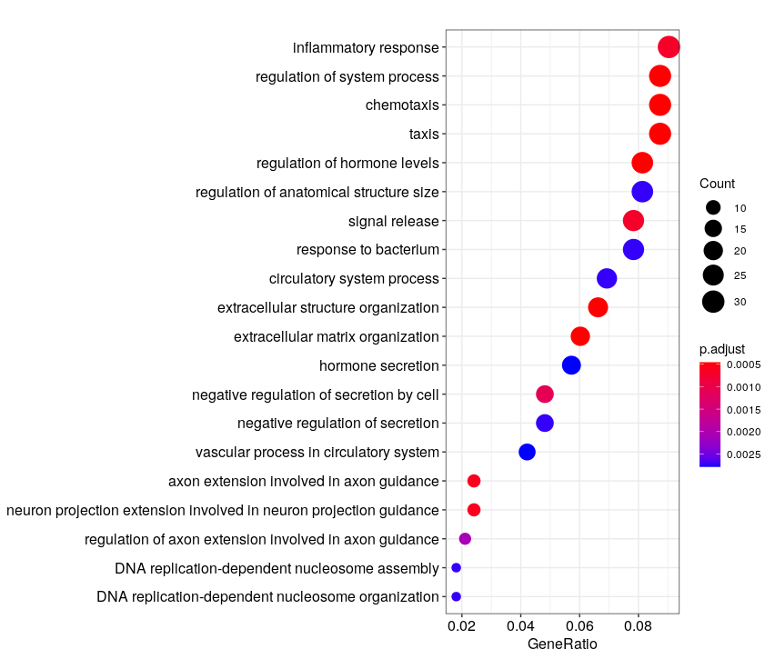
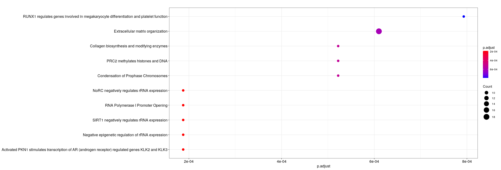

Once the reads have been mapped and counted, one can assess the differential expression of genes between different conditions.


**During this lesson, you will learn to :**

 * perform downstream analysis on gene sets, such as annotation (e.g. GO terms or Reactome pathways) over-representation.


## Material

[:fontawesome-solid-file-pdf: Download the presentation](../assets/pdf/RNA-Seq_07_Enrichment_analysis.pdf){target=_blank : .md-button }


[Rstudio website](https://www.rstudio.com/)

[clusterProfiler vignette/e-book](http://yulab-smu.top/clusterProfiler-book/)


## Downstream analysis : over-representation analysis

Having lists of differentially-expressed genes is quite interesting in itself,
however when there are many DE genes, it can be interesting to map these results 
onto curated sets of genes associated with known biological functions.

Here, we propose to use [clusterProfiler](https://bioconductor.org/packages/release/bioc/html/clusterProfiler.html),
which regroups several enrichment detection algorithms onto several databases.

We recommend you get inspiration from their very nice [vignette/e-book](http://yulab-smu.top/clusterProfiler-book/) to perform your own analyses.

If you do not have a list of DE genes from your previous analysis, you may use the following table:

[ :fontawesome-solid-file: Ruhland2016 DESeq2 results](../assets/txt/Ruhland2016.DESeq2.results.csv){target=_blank : .md-button }

The proposed correction will concern these.


??? success "Ruhland2016 analysis with clusterProfiler"

	We begin by reading the results of the DE analysis. Adapt this to your own analysis.
	Beware that edgeR and DESeq2 use different column names in their result tables (log2FoldChange/logFC , padj/FDR).

	```R
	library(AnnotationHub)
	library(AnnotationDbi)
	library(clusterProfiler)
	library(ReactomePA)
	
	library(org.Mm.eg.db)
	
	
	res = read.csv( 'Ruhland2016.DESeq2.results.csv'  , row.names=1)
	#let's define significance as padj <0.01 & abs(lfc) > 1
	res$sig = abs(res$log2FoldChange)>1 & res$padj<0.01
	
	table( res$sig )
	```
	
	Number of non-significant/significant genes 
	
	```
	 FALSE  TRUE 
	 17370   391 
	```
	
	Translating gene ENSEMBL names to their entrezID (this is what clusterProfiler uses), as well as Symbol (named used by most biologist).
	```R
	genes_universe <- bitr(rownames(res), fromType = "ENSEMBL",
	                       toType = c("ENTREZID", "SYMBOL"),
	                       OrgDb = "org.Mm.eg.db")
	
	head( genes_universe )
	#ENSEMBL ENTREZID  SYMBOL
	#2 ENSMUSG00000033845    27395  Mrpl15
	#4 ENSMUSG00000025903    18777  Lypla1
	#5 ENSMUSG00000033813    21399   Tcea1
	#7 ENSMUSG00000002459    58175   Rgs20
	#8 ENSMUSG00000033793   108664 Atp6v1h
	#9 ENSMUSG00000025907    12421  Rb1cc1
	
  dim(genes_universe)
  # 15443     3

  length(rownames(res))
  # 18012
	```
	
	```R
	genes_DE <- bitr(rownames(res)[which( res$sig==T )], fromType = "ENSEMBL",
	                 toType = c("ENTREZID", "SYMBOL"),
	                 OrgDb = "org.Mm.eg.db")
	dim(genes_DE)
	# 382   3
	```
	
	```R
	# GO "biological process (BP)" enrichment
	ego_bp <- enrichGO(gene          = as.character(unique(genes_DE$ENTREZID)),
	                   universe      = as.character(unique(genes_universe$ENTREZID)),
	                   OrgDb         = org.Mm.eg.db,
	                   ont           = "BP",
	                   pAdjustMethod = "BH",
	                   pvalueCutoff  = 0.01,
	                   qvalueCutoff  = 0.05,
	                   readable      = TRUE)
  # couple of minutes to run
  
	head(ego_bp)
	dotplot(ego_bp, showCategory = 20)
	# sample plot, but with adjusted p-value as x-axis
	#dotplot(ego_bp, x = "p.adjust", showCategory = 20)
	```
	
	
	
	```R
	# Reactome pathways enrichment
	reactome.enrich <- enrichPathway(gene=as.character(unique(genes_DE$ENTREZID)),
	                                 organism = "mouse",
	                                 pAdjustMethod = "BH",
	                                 qvalueCutoff = 0.01,
	                                 readable=T,
	                                 universe = genes_universe$ENTREZID)
  # <1 minute to run
	
	
	dotplot(reactome.enrich, x = "p.adjust")
	```
	


