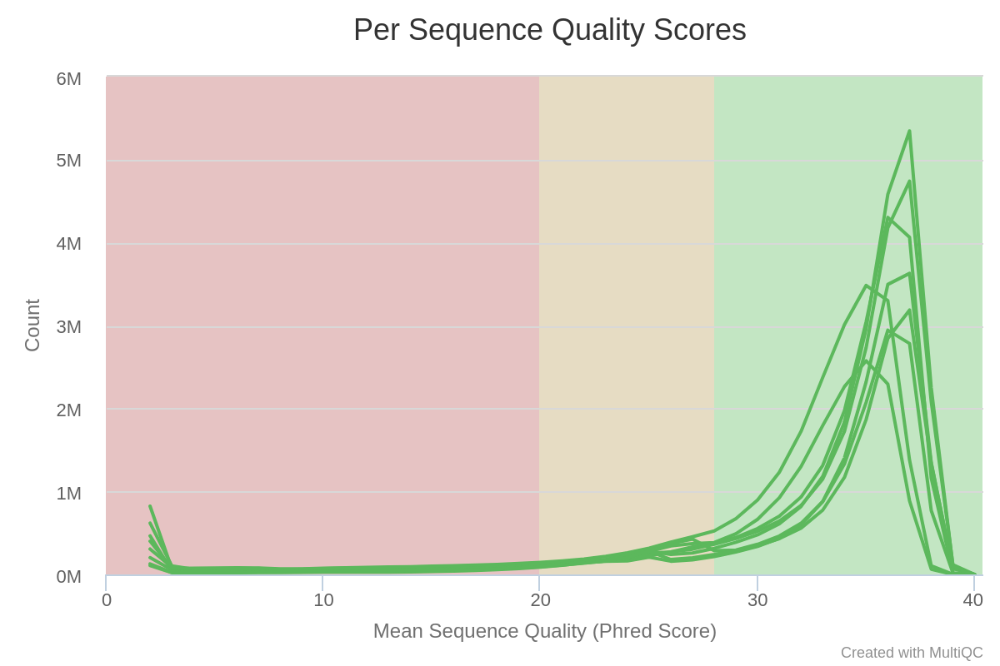
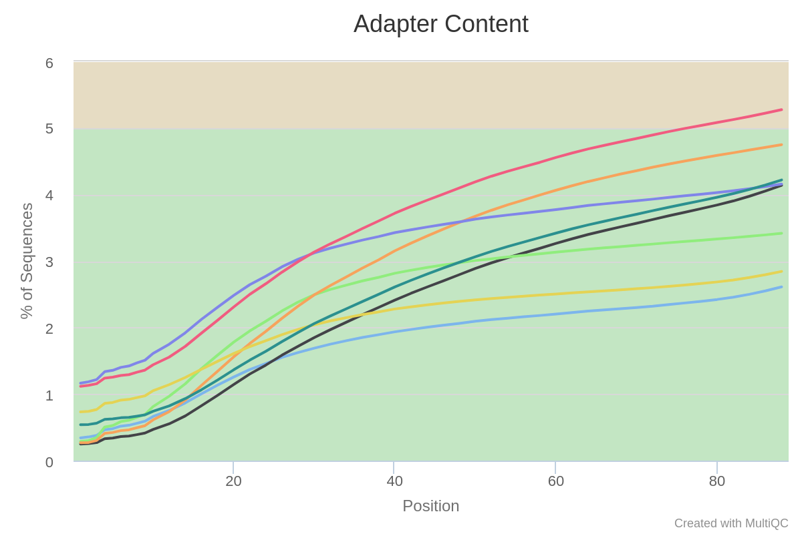

Quality Control is the essential first step to perform once you receive your data from your sequencing facility, typically as `.fastq` or `.fastq.gz` files.


**During this session, you will learn to :**

 * create QC report for a single file with fastqc
 * aggregate multiple QC reports using multiqc
 * interpret the QC reports for an entire RNA-seq experiment


!!! note
	Although we aim to present tools as stable as possible, software evolve and their precise interface can change with time.
	We strongly recommend you consult each command's help page or manual before launching them.
	To this end, we provide links to each tool's website. 

	This can also be useful to you if you are following this course without access to a compute cluster and have to install these tools on your machine.


## Material

[:fontawesome-solid-file-pdf: Download the presentation](../assets/pdf/RNA-Seq_02_QualityControl.pdf){: .md-button }

[FastQC website](https://www.bioinformatics.babraham.ac.uk/projects/fastqc/){: .md-button }

[MultiQC website](https://multiqc.info/){: .md-button }


## Meet the datasets

We will be working with two datasets from the following studies:

 * Liu et al. (2015) “RNA-Seq identifies novel myocardial gene expression signatures of heart failure” Genomics 105(2):83-89 [https://doi.org/10.1016/j.ygeno.2014.12.002](https://doi.org/10.1016/j.ygeno.2014.12.002)
 	* [GSE57345](https://www.ncbi.nlm.nih.gov/bioproject/?term=GSE57345)
 	* Samples of *Homo sapiens* heart left ventricles : 3 with heart failure, 3 without
 	* 6 samples of paired-end reads

 * Ruhland et al. (2016) “Stromal senescence establishes an immunosuppressive microenvironment that drives tumorigenesis” Nature Communications 7:11762 [https://dx.doi.org/10.1038/ncomms11762](https://dx.doi.org/10.1038/ncomms11762)
 	* [GSE78128](https://www.ncbi.nlm.nih.gov/geo/query/acc.cgi?acc=GSE78128)
 	* Samples of *Mus musculus* skin fibroblasts : 3 non-senescent (EtOH), 3 senescent (TAM)
 	* 6 samples of single-end reads


## Retrieving published datasets

!!! note
	If you are following this course with a teacher, then the for the data is already on the server. There is no need to download it again.

Most NGS data is deposited at the [Short Read Archive (SRA)](https://www.ncbi.nlm.nih.gov/sra/) hosted by the NCBI, with links from the [Gene Expression Omnibus (GEO)](https://www.ncbi.nlm.nih.gov/geo/)


 Several steps are required to retrieve data from a published study :
	
 1. find GEO or SRA identifier from publication.
 2. find the “run” identifiers for each sample (SRR).
 3. use [SRA Toolkit](https://github.com/ncbi/sra-tools/wiki/01.-Downloading-SRA-Toolkit) to dump data from the SRR repository to FASTQ files.


For example, on the Liu2015 dataset :

<!--
 1. Locate in their publication the GEO accession: GSE57345 
 2. Use the NCBI search engine to find this accession : [GSE57345](https://www.ncbi.nlm.nih.gov/bioproject/?term=GSE57345)
 3. This project is made of several sub-projects. Scroll down, and in the table find the Bioproject id : PRJNA246308 
 4. Go to the [SRA run selector](https://trace.ncbi.nlm.nih.gov/Traces/study/?acc=PRJNA246308&o=acc_s%3Aa), enter the Bioproject id -->
 1. locate GEO ID
 2. look it up on GEO website: https://www.ncbi.nlm.nih.gov/geo/query/acc.cgi?acc=GSE57345 
 3. Click Run Selector down the bottom.
 4. Copy/paste the SRR IDs from the table, or use the download accession list button to get a file listing them. 
 5. From the [results of your search](https://trace.ncbi.nlm.nih.gov/Traces/study/?acc=PRJNA246308&o=acc_s%3Aa), select all relevant runs
 6. Click on "Accession List" in the Select table 


 7. use `fastq-dump` (part of the [SRA Toolkit](https://github.com/ncbi/sra-tools/wiki/01.-Downloading-SRA-Toolkit)) on the downloaded accession list. For example:

 `fastq-dump --gzip --skip-technical --readids --split-files --clip SRR1272191`


!!! note
	 * You’ll need to know the nature of the dataset (library type, paired vs single end, etc.) before analysing it.
	 * `fastq-dump` takes a very long time
	 * [More information about fastq-dump](https://edwards.sdsu.edu/research/fastq-dump/)


## FastQC : a report for a single fastq file

[FastQC](https://www.bioinformatics.babraham.ac.uk/projects/fastqc/) is a nice tool to get a variety of QC measures from files such as `.fastq`, `.bam` or `.sam` files. 

Although it has many options, the default parameters are often enough for our purpose :

```sh
fastqc -o <output_directory> file1.fastq file2.fastq ... fileN.fastq
```

FastQC is reasonably intelligent, and will try to recognise the file format and uncompress it if necessary (so no need to decompress manually).


**Task:** 

 * Write one or more slurm-compatible sbatch scripts in your home directory that run FastQC analysis on each FASTQ file from the two datasets. These are accessible at : `/shared/data/DATA/Liu2015/` and `/shared/data/DATA/Ruhland2016`. 
 * Look at at least one of the QC report. What are your conclusions ? Would you want to perform some operations on the reads such as low-quality bases trimming, removal of adapters ?

!!! Warning
  Make sure your script writes the fastqc output to a folder within your own home directory.


Important points:

 * in your script, don't forget to load fastqc : `ml fastqc`.
 * there is no need to copy the read files to your home directory (in fact, it is good practice not to: it would create data redundancy, and we won't have enough space left on the disk anyway...).
 * FastQC RAM requirements : 1Gb is more than enough.
 * FastQC time requirements : ~ 5min / read file.
 * try to make sure FastQC outputs all reports in the same directory, this will save time for the next step ;-).

!!! note
	Reminder : to get the data from the distant server to your machine, you may use an SFTP client (filezilla, mobaXterm), or the command line tool from your machine :	`scp login@xx.xx.xx:~/path/to/file.txt .`


??? done "Liu2015 FastQC sbatch script"

	Here is an sbatch script for _one_ sample:

	```sh
	#!/usr/bin/bash
	#SBATCH --job-name=fastqc
	#SBATCH --time=01:00:00
	#SBATCH --cpus-per-task=1
	#SBATCH --mem=1G
	#SBATCH -o fastqc_Liu2015.o
	#SBATCH -e fastqc_Liu2015.e
	
	dataDir=/shared/data/DATA/Liu2015
	
	ml fastqc

	# creating the output folder
	mkdir -p FASTQC_Liu2015/

	fastqc -o FASTQC_Liu2015/ $dataDir/SRR1272187_1.fastq.gz
	```

  You could either have:
	
	* one sbatch script per sample (recommended),
	* OR put the `fastqc` commands for all the samples in the same script (not recommended).

	The first is recommended because you can submit both scripts at once and they will then run in parallel, whereas with the second option the samples would be handled sequentially and the overall job would take much longer to finish.


??? done "Ruhland2016 FastQC sbatch script"

	Here is an sbatch script for _one_ sample:

	```sh
	#!/usr/bin/bash
	#SBATCH --job-name=fastqc
	#SBATCH --time=01:00:00
	#SBATCH --cpus-per-task=1
	#SBATCH --mem=1G
	#SBATCH -o fastqc_Ruhland2016.o
	#SBATCH -e fastqc_Ruhland2016.e
	
	dataDir=/shared/data/DATA/Ruhland2016
	
	ml fastqc

	# creating the output folder
	mkdir -p FASTQC_Ruhland2016/

	fastqc -o FASTQC_Ruhland2016/ $dataDir/SRR3180540_TAM3_1.fastq.gz
	```

	You could either have:
	
	* one sbatch script per sample (recommended),
	* OR put the `fastqc` commands for all the samples in the same script (not recommended).

	The first is recommended because you can submit both scripts at once and they will then run in parallel, whereas with the second option the samples would be handled sequentially and the overall job would take much longer to finish.


??? done "Alternative sbatch script using array job"
  
  Here is a solution where all files from a same dataset can be processed in parallel (recommended) by using slurm array jobs.
  
	First, have a file named `Ruhland2016.fastqFiles.txt` containing the sample fastq file names :

	```
	SRR3180535_EtOH1_1.fastq.gz
	SRR3180536_EtOH2_1.fastq.gz
	SRR3180537_EtOH3_1.fastq.gz
	SRR3180538_TAM1_1.fastq.gz
	SRR3180539_TAM2_1.fastq.gz
	SRR3180540_TAM3_1.fastq.gz
	```

	Then, in the same folder, you can create this sbatch script :

	```sh
	#!/usr/bin/bash
	#SBATCH --job-name=fastqc
	#SBATCH --time=00:30:00
	#SBATCH --cpus-per-task=1
	#SBATCH --mem=1G
	#SBATCH -o fastqc_Ruhland2016.%a.o
	#SBATCH -e fastqc_Ruhland2016.%a.e
	#SBATCH --array 1-6%6

	ml fastqc

	dataDir=/shared/data/DATA/Ruhland2016
	
	sourceFILE=Ruhland2016.fastqFiles.txt
	
	## retrieving 1 filename from Ruhland2016.fastqFiles.txt
	fastqFILE=`sed -n ${SLURM_ARRAY_TASK_ID}p $sourceFILE`
	
	mkdir -p FASTQC_Ruhland2016/
	fastqc -o FASTQC_Ruhland2016/ $dataDir/$fastqFILE
	```

	When submitted with `sbatch`, this script will spawn 6 tasks in parallel, each with a different value of `${SLURM_ARRAY_TASK_ID}`.

	This is the recommended option : this allows you to launch all your job in parallel with a single script.


??? done "Interpretation of a report"

	[:fontawesome-solid-file-pdf: Download an annotated report](../assets/pdf/SRR3180535_EtOH1_1_fastqc.pdf){ .md-button}


## MultiQC : grouping multiple reports

In practice, you  likely will have more than a couple of samples (maybe even more than 30 or 50...) to handle: individually consulting and comparing the QC reports of each would be tedious.

[MultiQC](https://multiqc.info/) is a tool that lets you combine multiple reports in a single, interactive document that let you explore your data easily.

Here, we will be focusing on grouping FastQC reports, but MultiQC can also be applied to the output or logs of other bioinformatics tools, such as mappers, as we will see later.

In its default usage, `multiqc` only needs to be provided a path where it will find all the individual reports, and it will scan them and write a report named `multiqc_report.html`.

Although the default behaviour is quite appropriate, with a couple of options we get a slightly better control over the output:
 * `--interactive` : forces the plot to be interactive even when there is a lot of samples (this option can lead to larger html files).
 * `-f <filename>` : specify the name of the output file name.

For instance, a possible command line could be :
```sh
multiqc -f multiQCreports/Liu2015_multiqc.html --interactive Liu2015_fastqc/
```

There are many additional info which let you customize your report. Use `multiqc --help` or visit their [documentation webpage](https://multiqc.info/docs/#running-multiqc) to learn more.


**Task:** 

 * Write an sbatch script to run MultiQC for each dataset. 
 * Look at the QC reports. What are your conclusions ? 


Important points:

 * MultiQC RAM requirements : 1Gb should be more than enough.
 * MultiQC time requirements : ~ 1min / read file.
 * Exceptionally, there is no need to load multiqc as a module (it is not part of ComputeCanada and we installed it directly on the cluster, on other clusters it may not be the same).
 * Use `multiqc --help` to check the different options


??? done "MultiQC sbatch script"

	This is the script for the Ruhland2016 dataset. It presumes that the fastqc reports can be found in `FASTQC_Ruhland2016/ `

	```sh
	#!/usr/bin/bash
	#SBATCH --job-name=multiqc
	#SBATCH --time=00:30:00
	#SBATCH --cpus-per-task=1
	#SBATCH --mem=1G
	#SBATCH -o multiqc_Ruhland2016.o
	#SBATCH -e multiqc_Ruhland2016.e
	
		
	mkdir -p MULTIQC_Ruhland2016/
	
	multiqc -o MULTIQC_Ruhland2016/ FASTQC_Ruhland2016/ 
	```


??? done "Interpretation of a report"

	We will interpret the report for the Liu2015 data.

	

	The PHRED quality of reads drop below 30 around base 75. All samples seem affected. One sample seems to have some quality drops at specific timepoints/positions.

	

	Mean quality scores are on average fairly high, but some reads exhibit low values.

	

	Most samples do not deviate too much from the expected curve. The two samples colored in orange and red have a mode for a very specific value.
	This may be indicative of contamination, retaining specific rRNA, or adapter sequence content.

	

	Ns are present at specific positions in specific samples, in particular for one sample. This is reminiscent of the PHRED quality curves at the top of the report.
	It seems some flowcells had a problem at specific time-point/positions.

	

	This is colored red because this would be a problem if the data was coming from genomic DNA sequencing.
	However here we are in the context of RNA-seq : some transcripts are present in a large number of copies in the samples, and consequently it is expected that some sequences are over-represented.


	

	We see a clear trend of adapter contamination as we get closer to the reads' end. Note the y-scale though : we never go above a 6% content per sample.


	Overall, we can conclude that these samples all suffer from some adapter content and a lower quality toward the reads' second half. Furthermore, a few samples have a peculiar N pattern between bases 20 and 30.

	It is then strongly advised to either :

	 * perform some trimming : remove adapter sequences + cut reads when average quality becomes too low
	 * use a mapper that takes base quality in account AND is able to ignore adapter sequence (and even then, you could try mapping on both trimmed and untrimmed data to see which is the best)


