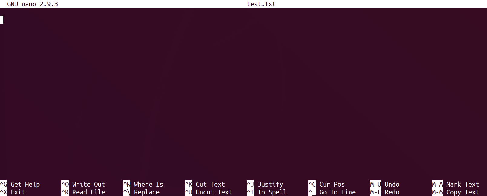

To conduct the practicals of this course, we will be using a dedicated High Performance Computing cluster. 
This matches the reality of most NGS workflows, which cannot be completed in a reasonable time on a single machine. 

To interact with this cluster, you will have to log in to a distant *head node*. From there you will be able to distribute your computational tasks to the cluster using a *job scheduler* called Slurm.

This page will cover our first contact with the distant cluster. 


**You will learn how to :**

 * connect to the server.
 * use the command line to perform basic operations on the head node.
 * exchange files between the server and your own machine.
 * submit a job to the cluster.


!!! note 
	If you are doing this course on your own, then the distant server will not be available. 
	Feel free to ignore or adapt any of the following steps to your own situation.


## Connect to the server

Say you want to connect to cluster with address `xx.xx.xx.xx` and your login is `login`.


!!! Warning 
	If you are doing this course with a teacher, use the link, login and password provided before or during the course. 

The first step will be to open a **terminal**

=== "Mac"
    
    Open a terminal, for instance with the application Xterm, or Xquartz.
    <!-- Might confuse some who just read "Terminal" -->

=== "Linux"
    
    Open a new terminal.

=== "Windows"
    
    Open the application mobaXterm (or any ssh-enabling terminal aplpication you prefer).

    On mobaXterm, click on "Start a local Terminal".

---

In the terminal type the following command:

```sh
ssh login@xx.xx.xx.xx
```

When prompted for your password, type it and press Enter. 

!!! note
  There is no cursor or '●' character appearing while you type your password. This is normal.


After a few seconds, you should be logged into the *head node* and ready to begin.


## Using command line on the cluster

Now that you are in the head node, time to get acquainted with your environment and to prepare the upcoming practicals. 
we will also use this as a short introduction/reminder on UNIX command line.

You can also refer to this nice [Linux Command Line Cheat Sheet](https://appletree.or.kr/quick_reference_cards/Unix-Linux/Linux%20Command%20Line%20Cheat%20Sheet.pdf).


---

At any time, you can get the location your terminal is currently at by typing:

```sh
pwd
```

When you start a session on a distant computer, you are placed in your `home` directory. So the cluster should return something like:

```
/shared/home/<login>
```

### creating a directory

Use the command line to create a repository called `day1` where you will put all materials relating to this first day.

??? done "Answer"
    ```sh
    mkdir day1
    ```

Move to that directory

??? done "Answer"
    ```sh
    cd day1
    ```

The directory `/shared/data/` contains data and solutions for most practicals. Check the content of that directory.

??? done "Answer"
    ```sh
    ls /shared/data/
    ```

Copy the script `fastqc_Liu2015_SRR1272187_1.sh` from  `/shared/data/Solutions/Liu2015` into your current directory.

??? done "Answer"
    ```sh
    cp /shared/data/Solutions/Liu2015/fastqc_Liu2015_SRR1272187_1.sh .
    ```

Print the content of this script to the screen.

??? done "Answer"
    ```sh
    more fastqc_Liu2015_SRR1272187_1.sh
    ```
    output:
    ```
    #!/usr/bin/bash
	#SBATCH --job-name=fastqc
	#SBATCH --time=00:30:00
	#SBATCH --cpus-per-task=1
	#SBATCH --mem=1G
	#SBATCH -o fastqc_Liu2015.o
	#SBATCH -e fastqc_Liu2015.e

	ml fastqc

	dataDir=/shared/data/DATA/Liu2015

	mkdir -p FASTQC_Liu2015/
	fastqc -o FASTQC_Liu2015/ $dataDir/SRR1272187_1.fastq.gz


    ```


### creating and editing a file

To edit files on the distant server, we will use the command line editor `nano`. It is far from the most complete or efficient one, but it can be found on most servers and is arguably among the easiest to start with.

!!! note
	Alternatively, feel free to use any other CLI editor you prefer, such as `vi`.

To start editing a file named `test.txt`, type :

```sh
	nano test.txt
```

You will be taken to the `nano` interface :



Type in your favorite movie quote, and then exit by pressing `Ctrl+x`, and then `y` and `Enter` when prompted to save the modifications you just made.

You can check that your modifications were saved by typing

```sh
more test.txt
```

### Exchanging files with the server

Whether you want to transfer some data to the cluster or retrieve the results of your latest computation, it is important to be able to exchange files with the distant server.


There exists several alternatives, depending on your platform and preferences

=== "command line"

	We will use `scp`.

	To copy a file from the server to your machine, use this syntax on a **terminal in your local machine** (open a new terminal if necessary).

	```sh
	scp <login>@<server-adress>:/path/to/file/on/server/file.txt /local/destination/
	```

	For example, to copy the file `test.txt` you just created in the folder `day1/`, to your current (local) working directory :

	```sh
	scp login@xx.xx.xx.xx:~/day1/file.txt .
	```	


	> here `~` will be interpreted as your home directory. This is useful and time-saving shorthand.


	To copy a file from your machine to the server:

	```sh
	scp /path/to/file/local/file.txt <login>@<server-adress>:/destination/on/server/
	```


=== "graphical alternative"

	There exist nice and free graphical software, such as [filezilla](https://filezilla-project.org/) to help you manage exchanges with the distant server. Feel free to install and experiment with it during the break.
	

=== "mobaXterm"

	If you are using mobaXterm, the left panel should provide a graphical SFTP browser in the left sidebar which allows you to browse and drag and drop files directly from/to the remote server.

	

## The computing cluster

The computing cluster follows an architecture that enables several users to distribute computational tasks among several machines which share a number of ressources, such as a common file system.


Users do not access each machine individually, but rather connect to a **head node**. From there, they can interact with the cluster using the **job scheduler** (here slurm).
The job scheduler role is to manage where and how to run the jobs of all users, such that waiting time is minimized and resource usage is optimized.

!!! Warning
	Everyone is connected to the same head node. Do not perform compute-intensive tasks on it or you will slow down everyone. 

Jobs can be submitted to the compute cluster using **sbatch scripts**, which contains 2 parts :

 * informations for the job scheduler:
 	- how much RAM / CPUs do I need ?
 	- where to write the logs of my job ?

 * bash commands corresponding to your task


But an example is worth a thousand words :

```sh
#!/usr/bin/bash
#SBATCH --job-name=test
#SBATCH --time=00:30:00
#SBATCH --cpus-per-task=1
#SBATCH --mem=1G
#SBATCH -o test_log.o


echo "looking at the size of the elements of /shared/data/"
sleep 10 # making the script wait for 10 seconds - this is just so we can see it later on. 
# `du` is a command that returns the size of a folder structure.
du -h -d 2 /shared/data/

```

The lines beginning by `#SBATCH` specify options to the job scheduler:

 * `#SBATCH --job-name=test` : the job name
 * `#SBATCH --time=00:30:00` : time reserved for the job : 30min. 
 * `#SBATCH --cpus-per-task=1` : cpus for the job 
 * `#SBATCH --mem=1G` : memory for the job
 * `#SBATCH -o test_log.o` : file to write output or error messages

!!! Warning
	Your job will fail as soon as it takes more time or RAM than requested.


Copy this script inside a new file named `mySbatchScript.sh`, then submit it to the job scheduler using :

```sh
	sbatch mySbatchScript.sh
```

Afterward, use the command `squeue` to monitor the jobs submitted to the cluster. Locate your job and wait for it to be accepted (`RUNNING` status), and then to complete (the job disappears from the output of `squeue`). 

Check the output of your job in the output file.

!!! note 
	When there are a lot of jobs, `squeue -u <username>` will limit the list to your jobs only


### Advanced cluster usage : job array 

Oftentime we have to repeat a similar analysis on a number of files, or for a number of different parameters.
Rather than writing each sbatch script individually, we can rely on job arrays to facilitate our task.

Say you want to execute a command, on 10 files (for example, map the reads of 10 samples).

You first create a file containing the name of your files (one per line); let's call it `readFiles.txt`.

Then, you write an sbatch array job script:

```sh
#!/usr/bin/bash
#SBATCH --job-name=test_array
#SBATCH --time=00:30:00
#SBATCH --cpus-per-task=1
#SBATCH --mem=1G
#SBATCH -o test_array_log.%a.o
#SBATCH --array 1-10%5


echo "job array id" $SLURM_ARRAY_TASK_ID

# sed -n <X>p <file> : retrieve line <X> of file
# so the next line grabs the file name corresponding to our job array task id and store it in the variable ReadFileName 
ReadFileName=`sed -n ${SLURM_ARRAY_TASK_ID}p readFiles.txt`

# here we would put the mapping command or whatever
echo $ReadFileName

```

Some things have changed compared to the previous sbatch script :

 * `#SBATCH --array 1-10%5` : will spawn independent tasks with ids from 1 to 10, and will manage them so that at most 5 run at the same time.
 * `#SBATCH -o test_array_log.%a.o` : the `%a` will take the value of the array task id. So we will have 1 log file per task (so 10 files).
 * `$SLURM_ARRAY_TASK_ID` : changes value between the different tasks. This is what we use to execute the same script on different files (using `sed -n ${SLURM_ARRAY_TASK_ID}p`)


